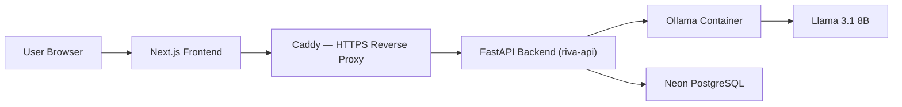

# Riva AI

A full-stack AI assistant built with FastAPI, Next.js, and Ollama — deployed to a self-managed VPS.

---

## Overview

Riva AI is a conversational assistant built as a production-style application. Users can chat with a locally-run Llama 3.1 model in three distinct interaction modes, with persistent chat history, account management, and an admin interface. Guest access is available without requiring login.

The backend is deployed and accessible at **[https://api.ai.shahidur.me](https://api.ai.shahidur.me)**.

---

## Features

| Feature | Description |
|---|---|
| **Three chat modes** | Friendly, Casual, and Study — each uses a distinct system prompt |
| **Streaming responses** | Server-Sent Events (SSE) stream tokens to the UI as they are generated |
| **Guest access** | Unauthenticated users can chat without creating an account (no history persisted) |
| **Authentication** | JWT-based login and registration |
| **Persistent chat history** | Authenticated sessions store messages in PostgreSQL |
| **Chat management** | Create, rename, delete, and search chats from the sidebar |
| **AI-generated chat titles** | After the first response, the backend generates a short title using the model |
| **Admin dashboard** | View user stats, enable/disable/delete accounts, toggle maintenance mode |
| **Maintenance mode** | Controlled via database flag; admin can flip it from the dashboard |
| **Responsive UI** | Mobile-friendly layout with collapsible sidebar |

---

## Architecture



- The frontend communicates with the backend through a Caddy reverse proxy that handles HTTPS/TLS.
- The backend and Ollama container are connected through a dedicated Docker network (`riva-network`). Ollama is not publicly exposed.
- PostgreSQL is provided by Neon's serverless platform and accessed over the internet using SSL.

---

## Technology Stack

| Layer | Technology |
|---|---|
| Frontend | Next.js 16, React 19, TypeScript, Tailwind CSS v4 |
| Backend | FastAPI, Python 3.12, Uvicorn |
| AI Runtime | Ollama — `llama3.1:8b` |
| Database | Neon Serverless PostgreSQL via `asyncpg` |
| Auth | PyJWT, bcrypt |
| HTTP Client | httpx (async, connection-pooled) |
| Containerization | Docker, Docker Compose |
| Reverse Proxy | Caddy |
| VPS | Oracle Cloud — Ubuntu ARM64 |

---

## Engineering Highlights

- **Async throughout**: FastAPI with `asyncpg` connection pooling and `httpx` async client — no blocking I/O.
- **SSE streaming**: The backend streams Ollama token output to the frontend in real time using Server-Sent Events. A background `asyncio.Task` saves the completed response to the database after streaming, so the client connection does not block the write.
- **Reusable Ollama client**: A single `httpx.AsyncClient` instance is created at application startup and shared across all requests, with configured connection limits and keep-alive settings.
- **Model warm-up**: On startup, the backend sends a minimal request to Ollama to load the model into memory before serving user traffic.
- **Database schema initialization**: `init_db()` runs at application startup using `CREATE TABLE IF NOT EXISTS` statements, so the schema is always consistent without an external migration tool.
- **JWT role-based access**: Tokens carry a `role` claim. Admin endpoints verify both the JWT claim and the database `is_admin` flag (defense in depth).
- **Isolated Docker networking**: The `riva-api` container communicates with Ollama through a named Docker network. The API port is bound to `127.0.0.1` only and is not reachable directly from the internet.
- **ARM64 deployment**: The Docker image uses `python:3.12-slim`, which supports Linux ARM64/aarch64 natively.
- **Environment-based configuration**: All runtime settings (database URL, JWT secret, Ollama parameters, CORS origins) are provided through environment variables. No credentials are hardcoded.

---

## Project Structure

```
├── backend/
│   ├── main.py              # FastAPI application, routes, lifespan, streaming
│   ├── database.py          # asyncpg pool, schema initialization
│   ├── auth.py              # JWT creation, verification, role dependencies
│   ├── requirements.txt     # Python runtime dependencies
│   ├── Dockerfile           # Production image (python:3.12-slim, ARM64-compatible)
│   └── .env.example         # Environment variable template
│
├── frontend/
│   ├── app/
│   │   ├── page.tsx         # Landing page
│   │   ├── chat/            # Main chat interface
│   │   ├── admin/           # Admin dashboard
│   │   ├── login/           # Login page
│   │   └── signup/          # Signup page
│   ├── components/
│   │   ├── chat/            # ChatWindow, Sidebar, MessageList, ChatComposer, etc.
│   │   └── ui/              # Navbar, SuccessTransition
│   ├── lib/
│   │   ├── api.ts           # All backend API calls and SSE stream handling
│   │   └── types.ts         # Shared TypeScript types
│   └── .env.example         # Frontend environment variable template
│
├── compose.production.yml   # Docker Compose for production deployment
├── .env.production.example  # Production environment variable template
└── docs/
    ├── ARCHITECTURE.md
    ├── DEPLOYMENT.md
    └── SECURITY.md
```

---

## Local Development

### 1. Clone

```bash
git clone https://github.com/Shahidur8381/RivaAI---A-friendly-AI-assistant.git
```

### 2. Backend

```bash
cd backend
python -m venv .venv

# Windows
.venv\Scripts\Activate.ps1
# Linux / macOS
source .venv/bin/activate

pip install -r requirements.txt
cp .env.example .env
```

Edit `backend/.env`:

```env
OLLAMA_BASE_URL=http://127.0.0.1:11434
OLLAMA_MODEL=llama3.1:8b
DATABASE_URL=postgresql://<user>:<password>@<host>/<dbname>?sslmode=require
JWT_SECRET=<strong-random-secret>
ALLOWED_ORIGINS=http://localhost:3000
```

Start the backend:

```bash
uvicorn main:app --reload --port 8000
```

### 3. Frontend

```bash
cd frontend
npm install
cp .env.example .env.local
```

Edit `frontend/.env.local`:

```env
NEXT_PUBLIC_API_URL=http://127.0.0.1:8000
```

Start the frontend:

```bash
npm run dev
```

### 4. Ollama

```bash
ollama pull llama3.1:8b
ollama serve
```

---

## Production Deployment

The backend is containerized and deployed using Docker Compose on an Oracle Cloud ARM64 VPS. Caddy handles HTTPS termination and proxies requests to the container. See [docs/DEPLOYMENT.md](docs/DEPLOYMENT.md) for the full deployment guide.

---

## Security

Secrets are managed through environment variables and are never committed. The backend is not directly reachable from the internet — it is proxied through Caddy and bound to localhost. Ollama is accessible only within the internal Docker network. See [docs/SECURITY.md](docs/SECURITY.md) for details.

---

## Project Status

- ✅ Backend deployed at `api.ai.shahidur.me`
- ✅ Production Docker configuration in repository
- ✅ Frontend codebase configured for Netlify deployment
- 🔧 Active development

---

## Author

**MD. Shahidur Rahman**  
Portfolio: [shahidur.me](https://shahidur.me)  
GitHub: [@Shahidur8381](https://github.com/Shahidur8381)
