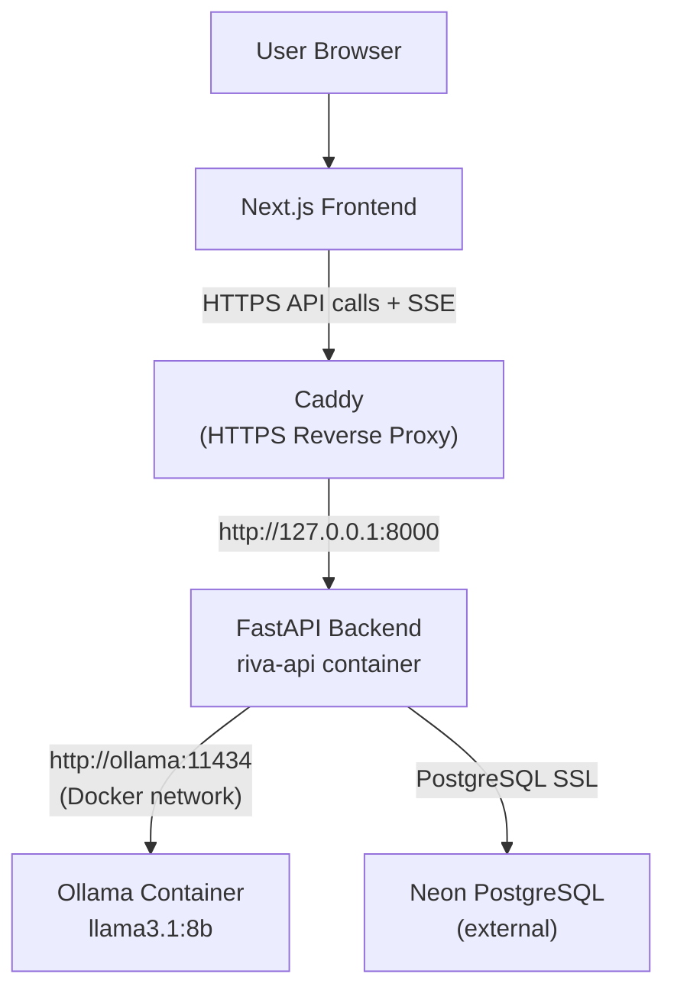

# Architecture

This document describes the design and implementation of the Riva AI system.

---

## System Overview

Riva AI is a full-stack application with three primary layers:

1. **Frontend** — A Next.js application served statically. It communicates with the backend via HTTP and Server-Sent Events (SSE).
2. **Backend** — A FastAPI application that handles authentication, chat logic, and communication with Ollama and PostgreSQL.
3. **Data & AI** — Neon PostgreSQL stores user and chat data. Ollama runs the Llama 3.1 8B model and provides a local HTTP inference API.

In production, requests from the browser flow through a Caddy reverse proxy to the backend. Ollama is never directly reachable from the internet.

---

## Architecture Diagram



---

## Frontend Architecture

**Framework**: Next.js 16 with the App Router. TypeScript throughout. Tailwind CSS v4 for styling.

**Pages**:

| Route | Purpose |
|---|---|
| `/` | Landing page. Shows sign-in button for guests, admin link for admin role |
| `/chat` | Main chat interface |
| `/login` | Login form |
| `/signup` | Account registration form |
| `/admin` | Admin dashboard (role-gated on the client side, and the backend enforces this server-side) |

**Component organization** (`frontend/components/chat/`):

| Component | Role |
|---|---|
| `ChatWindow` | Orchestrates auth state, chat session, streaming, sidebar, and message state |
| `ChatComposer` | Text input, send/stop controls, mode selector |
| `MessageList` | Renders the message thread |
| `MessageBubble` | Individual message — supports Markdown rendering via `react-markdown` + `react-syntax-highlighter` |
| `Sidebar` | Chat history list with search, rename, and delete. Rendered only for authenticated users |
| `ModeSelector` | Toggles between Friendly, Casual, and Study modes |
| `WelcomeScreen` | Shown when no messages exist. Contains suggestion prompts |
| `AuthModal` | Login/signup modal (also used on the login and signup pages) |

**API communication** (`frontend/lib/api.ts`):

All backend requests go through a single module. The base URL is configured via `NEXT_PUBLIC_API_URL` (environment variable).

- Standard HTTP calls use the native `fetch` API.
- Streaming calls (`streamChat`, `streamGuestChat`) open a `POST` request and read the response body as a `ReadableStream`, parsing SSE lines as they arrive.
- Auth tokens are stored in `localStorage` under the key `riva_token` and attached as `Authorization: Bearer <token>` headers.

---

## Backend Architecture

**Framework**: FastAPI with async support throughout. Served by Uvicorn.

### Startup / Lifespan (`main.py`)

The application uses FastAPI's `asynccontextmanager` lifespan:

1. Creates a shared `httpx.AsyncClient` pointed at `OLLAMA_BASE_URL`.
2. Opens an `asyncpg` connection pool (`min_size=1, max_size=5`).
3. Calls `init_db()` to apply schema if tables do not exist.
4. Sends a single warm-up request to Ollama to pre-load the model into memory.
5. On shutdown, closes the HTTP client and database pool.

### Reusable HTTP Client

A single `httpx.AsyncClient` instance handles all Ollama communication. It is configured with:
- Per-operation timeouts (connect: 5s, read: 300s, write: 10s)
- Connection limits (max 10 connections, 5 keep-alive)
- HTTP/1.1 (HTTP/2 disabled)

### Database Connection Pool

`asyncpg.create_pool` creates a pool shared across all requests. Connections are acquired with `async with pool.acquire()`.

### Authentication (`auth.py`)

- Passwords are hashed with `bcrypt`.
- JWTs are signed with `HS256` using `JWT_SECRET` from environment.
- Three FastAPI `Security` dependencies: `get_current_user` (requires valid JWT), `get_current_user_optional` (returns `None` for unauthenticated), `get_admin_user` (requires JWT with `role: admin`).
- `JWT_SECRET` must be provided at startup or the application raises `RuntimeError`.

### Chat Lifecycle

**Guest flow** (`POST /api/chat/guest`):
1. Receive message + mode.
2. Build system prompt for the selected mode.
3. Stream Ollama response directly back to the client via SSE.
4. No database writes.

**Authenticated flow** (`POST /api/chat`):
1. Verify JWT.
2. Look up chat in database (must belong to the requesting user).
3. Insert the user message.
4. Fetch the last 5 messages from the conversation as context.
5. Prepend system prompt for the selected mode.
6. Start an `asyncio.Task` (background) that streams Ollama and saves the completed response.
7. Stream tokens to the client through an `asyncio.Queue`.
8. Client disconnecting does not stop the background task — the model response is saved regardless.

**Title generation** (`POST /api/chats/{chat_id}/generate-title`):
After the first exchange in a new chat, the frontend calls this endpoint. The backend sends the first four messages to Ollama with a "generate a short title" prompt (non-streaming, 20 tokens max) and updates the chat record.

### Admin Endpoints

All admin endpoints use `get_admin_user` (JWT check) and additionally call `_verify_admin_db()`, which re-reads `is_admin` from the database. This prevents a revoked token from retaining admin access if the in-token claim was set at login time.

Endpoints:
- `GET /api/admin/stats` — user counts
- `GET /api/admin/users` — full user list
- `POST /api/admin/users/{uid}/disable`
- `POST /api/admin/users/{uid}/enable`
- `DELETE /api/admin/users/{uid}`
- `GET /api/admin/maintenance` — read maintenance flag
- `POST /api/admin/maintenance` — toggle maintenance flag

### Maintenance Mode

Stored as a string `"true"` / `"false"` in the `settings` table under key `maintenance_mode`. Read before each chat request. When enabled, chat endpoints return `503`.

---

## AI Request Flow

```
User message
  → ChatWindow (React) — selects mode, holds conversation in component state for guests
  → POST /api/chat (authenticated) or POST /api/chat/guest (guest)
  → FastAPI resolves JWT (authenticated) or skips auth (guest)
  → Authenticated: fetch last 5 messages from PostgreSQL as context
  → Prepend system prompt for selected mode (Friendly / Casual / Study)
  → POST http://ollama:11434/api/chat with stream: true
  → Ollama returns NDJSON token stream
  → FastAPI re-emits as SSE: "data: <json>\n\n"
  → Frontend ReadableStream parser appends each token to the message buffer
  → On "data: [DONE]", streaming ends
  → Authenticated: asyncio background task saves full response to PostgreSQL
```

---

## Database Architecture

Schema is defined in `database.py` and applied via `init_db()` at startup.

### Tables

**`users`**
```sql
CREATE TABLE IF NOT EXISTS users (
    id           SERIAL PRIMARY KEY,
    username     VARCHAR(50) UNIQUE NOT NULL,
    password_hash VARCHAR(255) NOT NULL,
    is_admin     BOOLEAN DEFAULT FALSE,
    disabled     BOOLEAN DEFAULT FALSE,
    created_at   TIMESTAMP WITH TIME ZONE DEFAULT CURRENT_TIMESTAMP
);
```

**`chats`**
```sql
CREATE TABLE IF NOT EXISTS chats (
    id         SERIAL PRIMARY KEY,
    user_id    INTEGER REFERENCES users(id) ON DELETE CASCADE,
    title      VARCHAR(255) NOT NULL,
    created_at TIMESTAMP WITH TIME ZONE DEFAULT CURRENT_TIMESTAMP
);
```

**`messages`**
```sql
CREATE TABLE IF NOT EXISTS messages (
    id         SERIAL PRIMARY KEY,
    chat_id    INTEGER REFERENCES chats(id) ON DELETE CASCADE,
    role       VARCHAR(20) NOT NULL,
    content    TEXT NOT NULL,
    created_at TIMESTAMP WITH TIME ZONE DEFAULT CURRENT_TIMESTAMP
);
```

**`settings`**
```sql
CREATE TABLE IF NOT EXISTS settings (
    key   VARCHAR(100) PRIMARY KEY,
    value TEXT NOT NULL DEFAULT ''
);
-- Seed row:
INSERT INTO settings (key, value) VALUES ('maintenance_mode', 'false')
ON CONFLICT (key) DO NOTHING;
```

### Indexes

```sql
CREATE INDEX IF NOT EXISTS idx_chats_user_id ON chats(user_id);
CREATE INDEX IF NOT EXISTS idx_messages_chat_id ON messages(chat_id);
```

### Relationships

- `chats.user_id` → `users.id` (CASCADE DELETE)
- `messages.chat_id` → `chats.id` (CASCADE DELETE)
- A user may have at most 100 chats (enforced in application logic, not a database constraint)

---

## Deployment Architecture

The production deployment runs on an **Oracle Cloud ARM64 Ubuntu VPS**.

| Component | Details |
|---|---|
| Backend container | `riva-api` built from `backend/Dockerfile`, `python:3.12-slim` |
| AI runtime | Existing `ollama` Docker container on the same host |
| Docker network | `riva-network` — connects `riva-api` and `ollama` |
| API port | Bound to `127.0.0.1:8000` — not publicly reachable |
| Reverse proxy | Caddy — handles HTTPS and proxies to `127.0.0.1:8000` |
| Database | Neon Serverless PostgreSQL — external, accessed over TLS |
| Public API | [https://api.ai.shahidur.me](https://api.ai.shahidur.me) |

---

## Design Decisions

**Neon over self-hosted PostgreSQL**: Offloads database operations, backup, and connection scalability to an external managed service. Accessed via `asyncpg` with SSL.

**Ollama not exposed to the internet**: The Ollama container has no published ports reachable from outside the host. It communicates with the backend container only through the Docker bridge network using the hostname `ollama`.

**API bound to localhost**: `127.0.0.1:8000:8000` in the Compose file ensures the FastAPI port is not directly accessible from the internet. Caddy acts as the single ingress point.

**Single reusable HTTP client**: Using a persistent `httpx.AsyncClient` for Ollama avoids the overhead of creating a new connection per request and allows connection reuse.

**Background task for DB writes**: Persisting the assistant response to the database in a background `asyncio.Task` means the database write does not block the SSE stream. The task holds a strong reference in `_active_tasks` to prevent premature garbage collection.

**ARM64-compatible image**: `python:3.12-slim` is multi-arch and builds natively on ARM64, avoiding emulation overhead.
